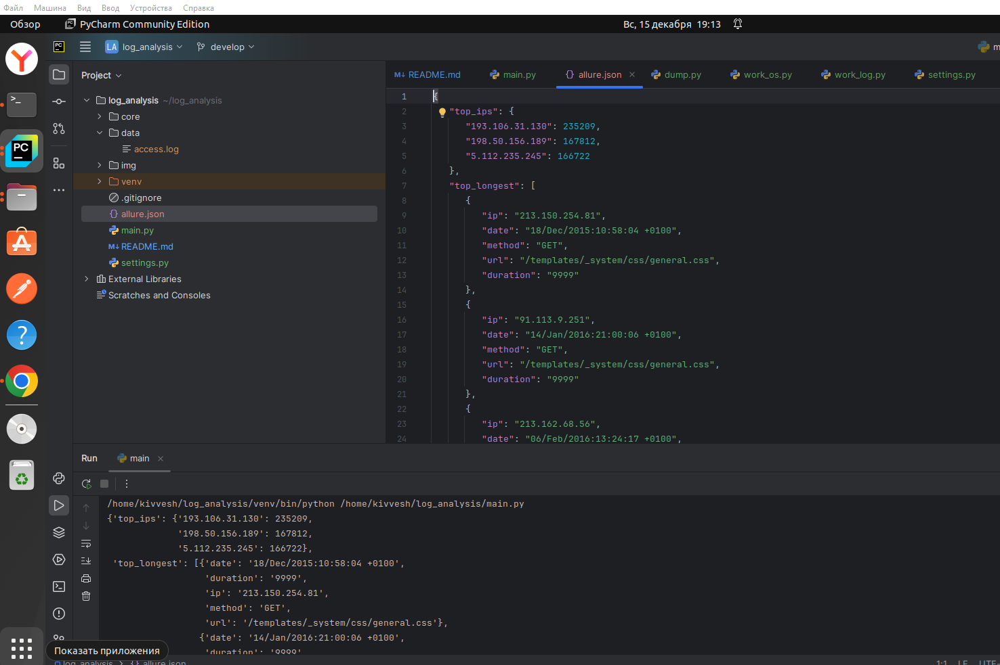

# log_analysis

Структура скрипта

1. settings.py - указываем путь до директории с логами или лог-файлом
2. core - модуль с функциями разделенные по задачам
3. data - директория с логами, в случае если не указан PATH в settings
4. main - файл для запуска скрипта
5. allure.json - отчет по работе скрипта

